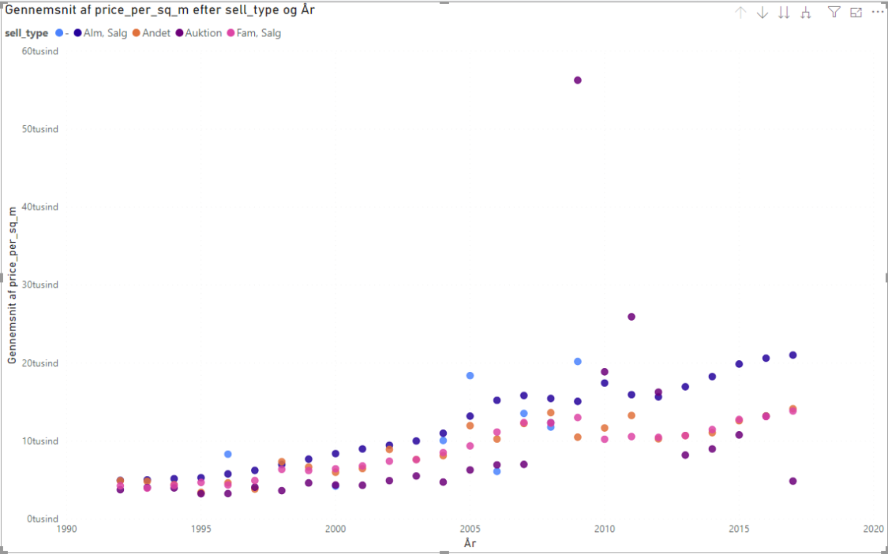

# Assignment 4: BI Clients & Visualization

Group: Dangerous Memory: Jake, Christian, Alexander

https://github.com/datsoftlyngby/soft2019fall-bi-teaching-material/tree/master/week38/assignment_4

## How to load project:

1. Download/Install Power BI Desktop from [here](https://www.microsoft.com/en-us/download/details.aspx?id=58494)

2. Download the Power BI file from [here](https://github.com/Business-Intelligence-Dangerous-Memory/Assignment_4/raw/master/PowerBIMap.pbix).

3. Double click on the file.

## Screenshot of our BI Client showing the Map with the sales visualized:

## Freestyle plot for business people: 
The historic development of the price per square meter broken down by sales type. It shows e.g that the price per square meter for "Alm. bolig" generally is higher than the other categories (and could be a solid investment category)

